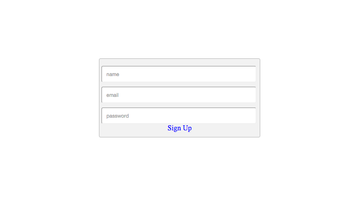

# starterTemplate-User-signUp-API
a Javacript starter template for signing up users with the Stamplay Rest API

**CLONING: When cloning this repo, you must initialize your app first to make it work.**

 1) **Initialize the front-end of your app with Stamplay**
 <br>
- Go to your command line and enter **stamplay init**
- When prompted, enter your **appID** & **API Key**

2) Signup
<br>
- When signing up a new user, note that **email** & **password** are required data that must be included in the request. 
Other values such as display name are optional.
```

function signUp(){

	var name = document.getElementById('name').value;
	var email = document.getElementById('email').value;
	var password = document.getElementById('password').value;

	var data = JSON.stringify({
  	"email": email,
  	"password": password,
  	"displayName": name
    });

	var xhr = new XMLHttpRequest();
	xhr.withCredentials = true;

	xhr.addEventListener("readystatechange", function () {
  		if (this.readyState === this.DONE) {
    		console.log(this.responseText);
  		}
	});

	xhr.open("POST", "https://[yourAppId].stamplayapp.com/api/user/v1/users");
	xhr.setRequestHeader("accept", "application/json");
	xhr.setRequestHeader("content-type", "application/json");
	xhr.send(data);
}
```


